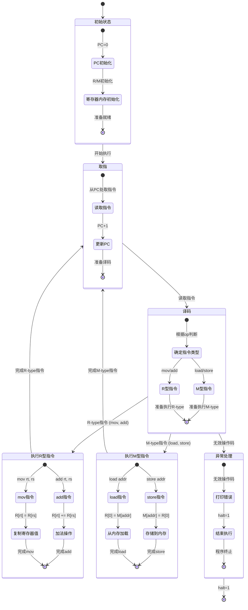

```mermaid title="YEMU状态机图示"
stateDiagram-v2
    [*] --> 初始状态
    初始状态 --> 取指: 开始执行
    取指 --> 译码: 读取指令
    译码 --> 执行R型指令: R-type指令 (mov, add)
    译码 --> 执行M型指令: M-type指令 (load, store)
    执行R型指令 --> 取指: 完成R-type指令
    执行M型指令 --> 取指: 完成M-type指令
    译码 --> 异常处理: 无效操作码
    异常处理 --> [*]: halt=1

    state 初始状态 {
        [*] --> PC初始化: PC=0
        PC初始化 --> 寄存器内存初始化: R/M初始化
        寄存器内存初始化 --> [*]: 准备就绪
    }

    state 取指 {
        [*] --> 读取指令: 从PC处取指令
        读取指令 --> 更新PC: PC+1
        更新PC --> [*]: 准备译码
    }

    state 译码 {
        [*] --> 确定指令类型: 根据op判断
        确定指令类型 --> R型指令: mov/add
        确定指令类型 --> M型指令: load/store
        R型指令 --> [*]: 准备执行R-type
        M型指令 --> [*]: 准备执行M-type
    }

    state 执行R型指令 {
        [*] --> mov指令: mov rt, rs
        mov指令 --> 复制寄存器值: R[rt] = R[rs]
        复制寄存器值 --> [*]: 完成mov
        [*] --> add指令: add rt, rs
        add指令 --> 加法操作: R[rt] += R[rs]
        加法操作 --> [*]: 完成add
    }

    state 执行M型指令 {
        [*] --> load指令: load addr
        load指令 --> 从内存加载: R[0] = M[addr]
        从内存加载 --> [*]: 完成load
        [*] --> store指令: store addr
        store指令 --> 存储到内存: M[addr] = R[0]
        存储到内存 --> [*]: 完成store
    }

    state 异常处理 {
        [*] --> 打印错误: 无效操作码
        打印错误 --> 结束执行: halt=1
        结束执行 --> [*]: 程序终止
    }
```